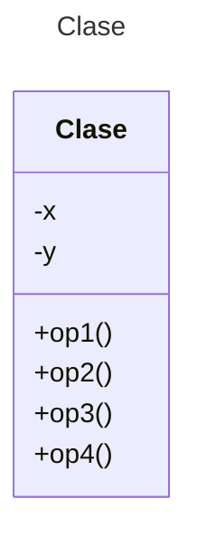

# Proyecto - Java POS - Maven

Plantilla básica para proyecto de Java Maven

## Diagrama de clases
[Editor en línea](https://mermaid.live/)

[Referencia-Mermaid](https://mermaid.js.org/syntax/classDiagram.html)

## Diagrama de clases UML con draw.io
El repositorio está configurado para crear Diagramas de clases UML con ```draw.io```. Para usarlo simplemente agrega un archivo con extensión ```.drawio.png```, das doble clic sobre el mismo y se activará el editor ```draw.io``` incrustado en ```VSCode``` para edición. Asegúrate de agregar las formas UML en el menú de formas del lado izquierdo (opción ```+Más formas```).

## Uso del proyecto con Maven

### Compilar
```
mvn -f app compile
```
### Probar N tests
```
mvn -f app test
```
### Probar 1 test
```
mvn -f app test -Dtest="AppTest#shouldAnswerWithTrue" 
```
### Ejecutar App
```
java -cp app/target/classes miPrincipal.App
```
### Empacar App
```
mvn -f app package
```
### Limpiar binarios
```
mvn -f app clean
```
### Generar el Diagrama de Secuencia con AppMap

Ejecute el comando:
```
mvn -f app com.appland:appmap-maven-plugin:prepare-agent test
```
Luego de clic en archivo `app/tmp/appmap/junit/miPrincipal_AppTest_testPOS.json`. Se mostrará el Diagrama de Secuencia.

## Comandos Git-Cambios y envío a Autograding

### Por cada cambio importante que haga, actualice su historia usando los comandos:
```
git add .
git commit -m "Descripción del cambio"
```
### Envíe sus actualizaciones a GitHub para Autograding con el comando:
```
git push origin main
```
Los comandos anteriores están considerados para un ambiente Linux. [Referencia.](https://www.baeldung.com/junit-run-from-command-line)
